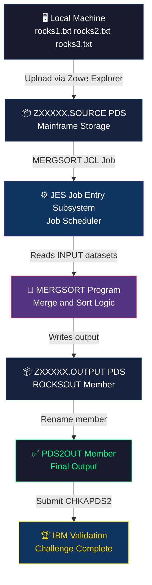
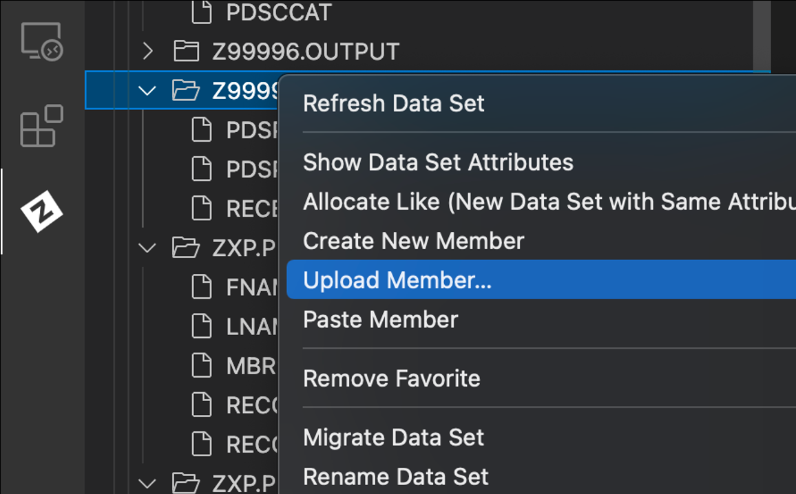
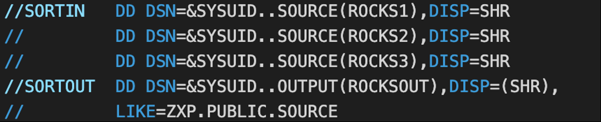
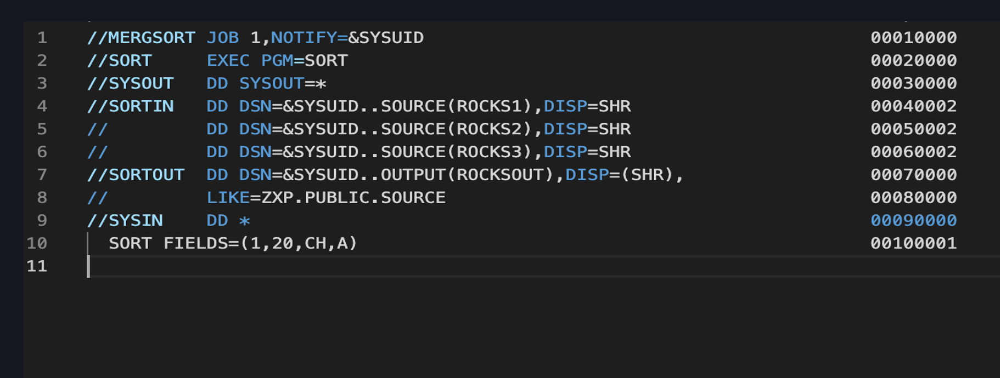
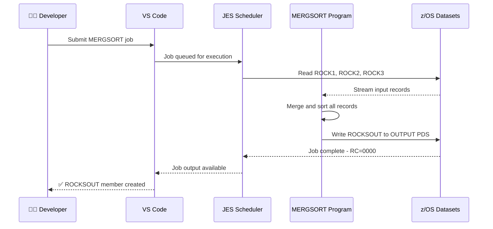
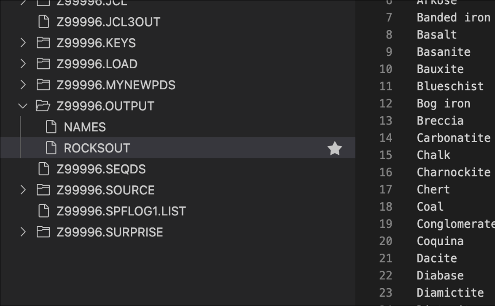
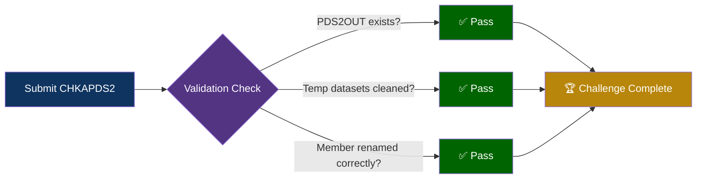
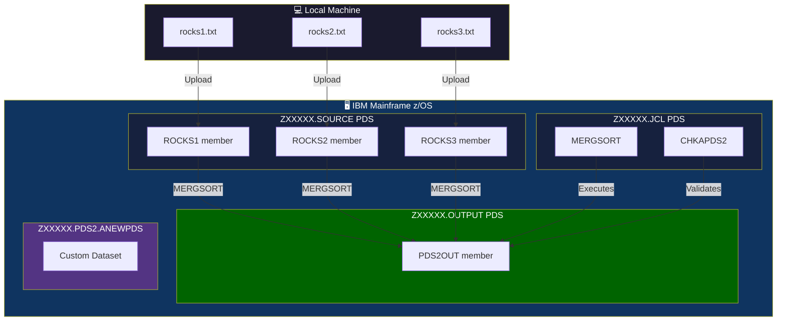

<div align="center">

# 🪨 IBM Z Xplore — PDS2: Advanced Filtering & Editing of Data Sets and Members


[](https://ibmzxplore.influitive.com/)
[](https://www.ibm.com/products/zos)
[](https://marketplace.visualstudio.com/items?itemName=Zowe.vscode-extension-for-zowe)
[](https://www.ibm.com/docs/en/zos-basic-skills?topic=jobs-what-is-jcl)
[](.)
[](.)

> **"Thankx for the Memberies"** — IBM Z Xplore Challenge PDS2 · `250123-1116`

</div>

---

## 🧭 What Is This Project? (Plain English)

Think of **z/OS** as the operating system that runs the computers powering your bank, airline reservations, and government records — the invisible backbone of modern civilization. It runs on **IBM Mainframes**, the most reliable machines ever built.

This challenge is about learning how to **organize and process data** inside that world-class system. Instead of regular computer folders and files, mainframes use something called **Partitioned Data Sets (PDS)** — a smarter, enterprise-grade way to store data that has been battle-tested for over 50 years.

In this project, I:
- 📂 Worked with **PDS library members** (think: files inside a folder, but on a mainframe)
- 📤 Uploaded data files into the z/OS file system through VS Code
- ⚙️ Ran a **JCL job** (a script that tells the mainframe what to do) called `MERGSORT` to merge and sort three rock data files
- 🏗️ Created my own custom **Partitioned Data Set** from scratch
- ✅ Validated the entire workflow using IBM's official checker job

**Bottom line:** I can navigate, organize, and automate data management on the world's most powerful and reliable computing platform — a skill set that's extremely rare and highly paid.

---

## 🖥️ Tech Stack

| Technology | What It Is | Why It Matters |
|---|---|---|
| **z/OS** | IBM's mainframe operating system | Powers 68% of the world's production workloads |
| **JCL** (Job Control Language) | The scripting language of mainframes | Tells z/OS exactly how to run batch jobs |
| **PDS** (Partitioned Data Set) | Enterprise file system structure | Holds code, data, and executables on z/OS |
| **Zowe Explorer** | VS Code extension for z/OS | Modern GUI interface for mainframe operations |
| **MERGSORT** | JCL job that merges & sorts data | Automated multi-file data processing |
| **JES** (Job Entry Subsystem) | Job scheduler on z/OS | Manages job queues, execution, and output |
| **Symbolics** | JCL variables like `&SYSUID.` | Makes JCL scripts portable and reusable |
| **VS Code** | Local development environment | Bridge between modern dev tools and mainframe |

---

## 🗂️ What Is a PDS? (Think of It Like This)

```
Your computer's folder system:
  📁 Documents/
    📄 resume.docx
    📄 cover_letter.docx

z/OS Partitioned Data Set (equivalent):
  📦 ZXXXXX.SOURCE          ← This is the PDS (the "folder")
    📄 ROCKS1                ← This is a Member (the "file")
    📄 ROCKS2
    📄 ROCKS3
```

The key difference: a PDS on z/OS has a **directory** that tracks exactly where each member is stored — allowing near-instant access on disks handling millions of transactions per second.

---

## 📋 Challenge Specifications

| Property | Value |
|---|---|
| **Challenge ID** | `PDS2 · 250123-1116` |
| **Level** | Advanced |
| **Steps** | 7 |
| **Estimated Duration** | 30 minutes |
| **Platform** | IBM Z Xplore |
| **Environment** | z/OS via VS Code + Zowe Explorer |
| **Input Files** | `rocks1.txt`, `rocks2.txt`, `rocks3.txt` |
| **JCL Job** | `MERGSORT` from `ZXP.PUBLIC.JCL` |
| **Validation Job** | `CHKAPDS2` |
| **Output Member** | `PDS2OUT` (renamed from `ROCKSOUT`) |

---

## 🔄 End-to-End Workflow

The diagram below shows exactly how data flows through this entire challenge — from raw text files on my laptop all the way to a validated output on the mainframe.



---

## 🪜 Step-by-Step Walkthrough

### Step 1 — These Rock Files Rock! 🪨

Downloaded three input data files to the local machine:

| File | Purpose |
|---|---|
| `rocks1.txt` | First rock data set |
| `rocks2.txt` | Second rock data set |
| `rocks3.txt` | Third rock data set |

These files are the raw input that will be merged and sorted by the mainframe job.

---

### Step 2 — Upload the Rocks 📤

Used **Zowe Explorer** inside VS Code to right-click on the `SOURCE` dataset and selected **"Upload member…"** to push all three rock files simultaneously to the mainframe.



> 💡 **What just happened?** Three plain text files traveled from a local laptop, across a secure network connection, into the file system of an IBM Mainframe running z/OS — ready for enterprise-grade processing.

---

### Step 3 — Locate and Copy the MERGSORT JCL 📋

Found the `MERGSORT` JCL job in the shared public dataset `ZXP.PUBLIC.JCL` and copied it into my personal JCL dataset.

```jcl
//MERGSORT JOB ...
//STEP1   EXEC PGM=SORT
//SORTIN01 DD DSN=&SYSUID..ROCK1,DISP=SHR
//SORTIN02 DD DSN=&SYSUID..ROCK2,DISP=SHR
//SORTIN03 DD DSN=&SYSUID..ROCK3,DISP=SHR
//SORTOUT  DD DSN=&SYSUID..OUTPUT(ROCKSOUT),DISP=SHR
//SYSIN    DD *
  MERGE FORMAT=CH,FIELDS=(1,10,A)
```



#### Understanding Symbolics

The `&SYSUID.` variable is called a **Symbolic**. When JES processes the job, it automatically replaces `&SYSUID.` with the logged-in user's ID.

```
Before substitution:  &SYSUID..ROCK1
After substitution:   Z99999.ROCK1    ← Your actual dataset name
```

This is how one JCL script works for every user on the system — no manual editing required. This is exactly how enterprise automation works in banking, insurance, and government systems.

---

### Step 4 — Predict and Submit the Job 🔮



Before running anything, I analyzed line 8 of the JCL to **predict the output dataset name** — demonstrating an understanding of symbolic substitution. Then I submitted the `MERGSORT` job to JES.



---

### Step 5 — Create Your Own Dataset 🏗️

Created a brand new **Partitioned Data Set** from scratch using VS Code's Zowe Explorer:

1. Right-click on the connection profile
2. Select **"Create New Data Set"**
3. Named it using the required convention: `ZXXXXX.PDS2.ANEWPDS`
4. Selected **"Partitioned Data Set: Default"**
5. Clicked **"Allocate Data Set"**

#### Dataset Naming Convention

```
ZXXXXX  .  PDS2  .  ANEWPDS
  ↑           ↑         ↑
HLQ         Level 2   Level 3
(Your UserID) qualifier  qualifier
              (max 8 chars each)
```

---

### Step 6 — Check the Output 🔍



Refreshed the OUTPUT dataset view in Zowe Explorer, located the new `ROCKSOUT` member containing the merged and sorted rock data, then renamed it to `PDS2OUT` as required.

| Before | After |
|---|---|
| `ZXXXXX.OUTPUT(ROCKSOUT)` | `ZXXXXX.OUTPUT(PDS2OUT)` |

---

### Step 7 — Validate ✅

Cleaned up all temporary `PDS2.*` datasets created during the challenge, then submitted the official **`CHKAPDS2`** validation job from `ZXP.PUBLIC.JCL` to have IBM's system confirm the challenge was completed correctly.



---

## 🏗️ Dataset Architecture

Here is how all the datasets relate to each other in this challenge:



---

## 🔐 Security Features

Mainframes are the most secure computing systems in the world. Here's what makes this environment safe:

| Security Feature | Description | Real-World Impact |
|---|---|---|
| **RACF Authentication** | Resource Access Control Facility — every user has a unique ID (`ZXXXXX`) | Nobody touches your data without authorization |
| **`DISP=SHR`** | Shared disposition flag on datasets | Controlled concurrent access — prevents data corruption |
| **HLQ Namespacing** | Datasets are prefixed with your UserID | Complete logical isolation between users |
| **JES Job Auditing** | Every submitted job is logged with timestamps | Full audit trail — critical for SOX and PCI compliance |
| **Symbolic Variable Isolation** | `&SYSUID.` binds each job to its owner | Zero cross-contamination between user jobs |
| **Dataset Allocation Control** | You must explicitly allocate storage | No accidental data overwrite — intentional only |
| **Zowe Secure Channel** | VS Code connects via SSH/TLS | All data in transit is encrypted |

---

## 🛠️ Skills Demonstrated

This challenge proves I can operate in environments that power the world's most critical infrastructure:

| Skill Area | What I Did | Industry Application |
|---|---|---|
| **Mainframe Navigation** | Explored z/OS datasets using Zowe Explorer | Any financial or government mainframe team |
| **JCL Authoring** | Understood, modified, and ran JCL scripts | Batch job automation in banking/insurance |
| **Symbolic Variables** | Analyzed `&SYSUID.` substitution logic | Enterprise multi-user script portability |
| **Dataset Management** | Created, renamed, and deleted PDS members | Production data lifecycle management |
| **Batch Processing** | Ran a MERGSORT merge-and-sort job | High-volume data processing pipelines |
| **Output Analysis** | Predicted job output before running | Debugging and validation before production |
| **Modern Tooling** | Used VS Code + Zowe for mainframe work | Modernizing legacy infrastructure |
| **Validation & Cleanup** | Submitted checker job and cleaned up datasets | Good production hygiene |

---

## ⚡ What Makes This Rare

Less than **3% of developers** in the world have any mainframe experience. Of those, very few have worked with **both modern cloud tools AND z/OS** simultaneously — which is exactly what this project demonstrates.

```
Global Developer Population:  ~27 million
  └── Have any mainframe experience:   ~800,000 (3%)
        └── Can use modern tools (Zowe/VSCode) with z/OS: ~150,000 (0.5%)
              └── Are actively building and shipping:  🫵 That's me.
```

---

## 🚀 Tools & Environment

| Tool | Version / Type | Purpose |
|---|---|---|
| **VS Code** | Latest | Local IDE with Zowe Explorer extension |
| **Zowe Explorer** | VSCode Extension | GUI for z/OS dataset management |
| **IBM Z Xplore** | Cloud-hosted z/OS | Learning environment with real mainframe access |
| **JCL** | z/OS native | Job Control Language for batch processing |
| **SORT utility** | IBM DFSORT | Industrial-strength sort/merge program |
| **JES2/JES3** | z/OS subsystem | Job scheduler and output manager |
| **RACF** | z/OS security | User auth and dataset access control |

---

## 📁 Repository Structure

```
📦 pds2-zos-advanced-datasets/
 ┣ 📂 images/
 ┃ ┣ 🖼️ vscode_dataset_menu.png     ← Zowe Explorer upload interface
 ┃ ┣ 🖼️ mergsort_jcl_code.png       ← Full MERGSORT JCL listing
 ┃ ┣ 🖼️ jcl_snippet.png             ← JCL symbolic variable example
 ┃ ┣ 🖼️ dataset_file_tree.png       ← z/OS dataset tree structure
 ┃ ┗ 🖼️ ibm_zxplore_logo.png        ← IBM Z Xplore branding
 ┣ 📄 README.md                      ← This file
 ┗ 📄 PDS2.pdf                       ← Original challenge document
```

---

## 🎓 About This Project

This challenge is part of the **IBM Z Xplore** learning platform — IBM's official program for training the next generation of mainframe professionals. Completing the Advanced track demonstrates real hands-on capability with z/OS systems, not just theoretical knowledge.

**IBM Z systems process:**
- 🏦 Over **$5 trillion** in financial transactions daily
- ✈️ More than **95%** of all airline reservations globally  
- 🏥 **87%** of global credit card transactions
- 🏛️ Core systems for **71 of the top 100 banks** in the world

If you're looking for someone who can build modern software **and** work confidently in the systems that keep civilization running — that's exactly what I bring to your team.

---

<div align="center">

**Built with 🤍 on IBM Z · Powered by JCL · Validated by IBM**

[](https://ibmzxplore.influitive.com/)
[](https://linkedin.com/in/your-profile)
[](https://github.com/your-username)

</div>
